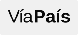

  

#  Diarios Liberados

Una extensión compatible con múltiples navegadores (Chrome, Edge, Brave, Opera, Vivaldi, Firefox, etc.) que **mejora la experiencia de lectura en más de 50 portales de medios argentinos**. Se puede usar en la computadora y también en teléfonos Android, a través de Firefox. En los medios que lo requieren, desbloquea notas exclusivas para suscriptores o socios, además elimina publicidades intrusivas y bloquea diálogos de notificaciones. Todas estas características son configurables e independientes desde el menú de la extensión (podés elegir en todo momento si activar o desactivar el desbloqueo de contenidos exclusivos, el bloqueo de publicidad o el ocultamiento de notificaciones). Algunos portales incluyen funcionalidades adicionales: visualización de versiones impresas (La Capital), resúmenes generados por IA y escucha de notas (La Nación), y cobertura extendida a los grupos editoriales completos de Clarín y Perfil. Se irán agregando nuevos medios y funcionalidades con el paso del tiempo.

> 🔗 **Compartí la extensión**
>
> ¿Se la querés recomendar a alguien? Pasale este enlace en lugar del repositorio: tiene la presentación, los medios soportados y la instalación explicada paso a paso, pensada para quien nunca instaló una extensión.
>
> ### 👉 <https://lucaspier.github.io/diarios-liberados/>

## Portales soportados

<table>
  <tr>
    <td align="center" width="160"><a href="#clarín"> Clarín</a></td>
    <td align="center" width="160"><a href="#la-nación"> La Nación</a></td>
    <td align="center" width="160"><a href="#infobae"> Infobae</a></td>
    <td align="center" width="160"><a href="#página12"> Página/12</a></td>
    <td align="center" width="160"><a href="#perfil"> Perfil</a></td>
    <td align="center" width="160"><a href="#el-destape"> El Destape</a></td>
  </tr>
  <tr>
    <td align="center" width="160"><a href="#la-capital"> La Capital</a></td>
    <td align="center" width="160"><a href="#la-voz-del-interior"> La Voz del Interior</a></td>
    <td align="center" width="160"><a href="#la-gaceta"> La Gaceta</a></td>
    <td align="center" width="160"><a href="#el-litoral"> El Litoral</a></td>
    <td align="center" width="160"><a href="#los-andes"> Los Andes</a></td>
    <td align="center" width="160"><a href="#el-día"> El Día</a></td>
  </tr>
  <tr>
    <td align="center" width="160"><a href="#río-negro"> Río Negro</a></td>
    <td align="center" width="160"><a href="#elonce"> Elonce</a></td>
    <td align="center" width="160"><a href="#el-ciudadano"> El Ciudadano</a></td>
    <td align="center" width="160"><a href="#rosario3"> Rosario3</a></td>
    <td align="center" width="160"><a href="#cadena-3"> Cadena 3</a></td>
    <td align="center" width="160"><a href="#aire-de-santa-fe"> Aire de Santa Fe</a></td>
  </tr>
  <tr>
    <td align="center" width="160"><a href="#mdz-online"> MDZ Online</a></td>
    <td align="center" width="160"><a href="#diario-uno"> Diario Uno</a></td>
    <td align="center" width="160"><a href="#rosario-plus"> Rosario Plus</a></td>
    <td align="center" width="160"><a href="#diario-uno-entre-ríos"> Diario Uno Entre Ríos</a></td>
    <td align="center" width="160"><a href="#diario-uno-santa-fe"> Diario Uno Santa Fe</a></td>
    <td align="center" width="160"><a href="#vía-país"> Vía País</a></td>
  </tr>
  <tr>
    <td align="center" width="160"><a href="#minuto-uno"> Minuto Uno</a></td>
    <td align="center" width="160"><a href="#la-política-online"> La Política Online</a></td>
    <td align="center" width="160"><a href="#letra-p"> Letra P</a></td>
    <td align="center" width="160"><a href="#diario-popular"> Diario Popular</a></td>
    <td align="center" width="160"><a href="#el-cronista"> El Cronista</a></td>
    <td align="center" width="160"><a href="#ámbito"> Ámbito</a></td>
  </tr>
  <tr>
    <td align="center" width="160"><a href="#tn"> TN</a></td>
    <td align="center" width="160"><a href="#olé"> Olé</a></td>
    <td align="center" width="160"><a href="#tyc-sports"> TyC Sports</a></td>
    <td align="center" width="160"></td>
    <td align="center" width="160"></td>
    <td align="center" width="160"></td>
  </tr>
</table>

> 💡 **Dato:** La extensión también cubre otros sitios del Grupo Clarín y la Editorial Perfil, como: Ciudad Magazine, El Trece TV, Radio Mitre, La 100, Elle, Cienradios, Rolling Stone, Ohlalá!, 442, Noticias, Caras, Fortuna, Weekend, Parabrisas, Super Campo, Luz, Mia, Lunateen, Horizonte, Exitoina, Marie Claire, Radio Perfil, Rouge, Hombre, Perfil Brasil, Buenos Aires Times y Canal Net TV. Además, incluye Puerto Negocios del grupo El Litoral.

## Instalación paso a paso

La extensión no se instala igual en todos lados: elegí el camino que te toque.

<table>
  <tr>
    <td><b>Basados en Chromium</b></td>
    <td>
       Chrome &nbsp;
       Edge &nbsp;
       Brave &nbsp;
       Opera &nbsp;
       Vivaldi &nbsp;
       Chromium
    </td>
  </tr>
  <tr>
    <td><b>Basados en Firefox</b></td>
    <td>
       Firefox &nbsp;
       Floorp &nbsp;
       Zen &nbsp;
       LibreWolf &nbsp;
       Waterfox
    </td>
  </tr>
  <tr>
    <td><b>En el celular</b></td>
    <td>
       Firefox para Android
    </td>
  </tr>
</table>

### En Chrome, Edge, Brave, Opera, Vivaldi o Chromium

1. **Descargar:** Hacé clic en el botón verde que dice **`<> Code`** (arriba de todo en esta página), y elegí la opción **`Download ZIP`**.
2. **Descomprimir:** Extraé el contenido del archivo ZIP descargado en una carpeta de tu compu que no vayas a borrar después.
3. **Abrir Extensiones:** En tu navegador, andá a la sección de extensiones. Podés hacerlo escribiendo `chrome://extensions/` en la barra de direcciones (o `edge://extensions/`, `brave://extensions/`, dependiendo cuál uses).
4. **Modo Desarrollador:** Activá la opción **"Modo de desarrollador"** (suele ser una llavecita arriba a la derecha).
5. **Instalar:** Hacé clic en el botón **"Cargar descomprimida"** (o *Load unpacked*).
6. **Seleccionar ruta:** Elegí la carpeta que extrajiste en el paso 2 (fijate de seleccionar la carpeta que tiene directamente los archivos adentro).
7. **Modo Incógnito (Recomendado):** Para evitar problemas o bloqueos, andá a los **Detalles** de la extensión recién instalada y activá la opción **"Permitir en modo incógnito"**.

*Para actualizar:* descargá el ZIP otra vez, reemplazá el contenido de la carpeta y hacé clic en el botón de recargar (↻) de la extensión.

### En Firefox (computadora)

Los mismos pasos sirven para los navegadores basados en Firefox: Floorp, Zen, LibreWolf y Waterfox.

1. **Descargar:** Entrá en la [última versión publicada](https://github.com/LucasPier/diarios-liberados/releases/latest) y hacé clic en el archivo terminado en **`.xpi`**.
2. **Seguir:** Firefox va a preguntar *"¿Permitir que lucaspier.github.io instale un complemento?"*. Hacé clic en **"Seguir con la instalación"**. No es un error: Firefox lo pregunta con cualquier complemento que no venga de su tienda oficial. Puede que no te aparezca, porque pregunta una sola vez por sitio; en ese caso pasá directo al paso siguiente.
3. **Añadir:** Cuando aparezca *"Añadir Diarios Liberados"* con la lista de sitios, marcá en *"Ajustes opcionales"* la opción **"Permitir que la extensión se ejecute en ventanas privadas"** (recomendado) y hacé clic en **"Añadir"**. Si te lo salteás, se activa igual desde `about:addons`.

*Para actualizar:* no hay que hacer nada, la extensión se actualiza sola. Si en una versión nueva se suma un medio y no funciona, abrí el menú de la extensión: te va a ofrecer darle acceso a ese sitio con un botón.

> 💡 Si en lugar de instalarse el archivo se descarga, entrá en `about:addons`, tocá el engranaje y elegí **"Instalar complemento desde archivo"**.

### En Firefox para Android

1. **Descargar:** Desde Firefox para Android, entrá en la [última versión publicada](https://github.com/LucasPier/diarios-liberados/releases/latest) y tocá el archivo terminado en **`.xpi`**. Se va a guardar en tus descargas sin ofrecerte instalarlo: es así, se instala en los pasos que siguen.
2. **Habilitar la instalación desde archivo:** Entrá en **Ajustes → Acerca de Firefox** y tocá **cinco veces** el logo de Firefox. Un mensaje te va a avisar que se habilitó el menú.
3. **Elegir el archivo:** Volvé a **Ajustes**, tocá **"Instalar extensión desde archivo"** y elegí el que descargaste.
4. **Agregar:** Cuando aparezca *"Agregar Diarios Liberados"* con la lista de sitios, marcá en *"Ajustes opcionales"* la opción **"Permitir que la extensión se ejecute en navegación privada"** (recomendado) y tocá **"Agregar"**.

> ⚠️ **Para abrir el menú de la extensión tiene que haber un sitio abierto.** Entrá por el menú **⋮ → Extensiones** con un diario cargado en una pestaña normal. Desde la pantalla de inicio de Firefox no abre: es una limitación conocida de Firefox para Android, no de la extensión.

*Para actualizar:* descargá el archivo otra vez y repetí la instalación desde los ajustes. No se pierde la configuración.

> 📱  
> **¿Se puede usar en celulares?**  
> **En Android sí**, únicamente con Firefox y siguiendo los pasos de acá arriba. Ningún navegador basado en Chromium permite instalar extensiones en el celular.  
> **En iPhone y iPad no.** Apple obliga a que todos los navegadores usen el motor de Safari y a que las extensiones se distribuyan dentro de una app aprobada por la App Store, así que Firefox para iOS no admite complementos. No es una limitación de esta extensión sino de la plataforma.

## Características según cada medio

### Clarín

✅ Permite el acceso a notas para suscriptores

✅ Se quitan las publicidades de todo el sitio

✅ Se bloquean diálogos de notificaciones

✅ Incluye todos los medios del Grupo Clarín: Ciudad Magazine, El Trece TV, Radio Mitre, La 100, Elle y Cienradios.

### La Nación

❌ Por el momento NO permite leer nota para suscriptores

✅ Permite ver resúmenes generados por IA

✅ Permite escucha de notas

✅ Se quitan las publicidades de todo el sitio

✅ Se bloquean diálogos de notificaciones

### Infobae

ℹ️ El medio no requiere suscripción para leer sus notas

✅ Se quitan las publicidades de todo el sitio

✅ Se bloquean diálogos de notificaciones

### Página/12

✅ Permite el acceso a notas para soci@s

✅ Se quitan las publicidades de todo el sitio

✅ Se bloquean diálogos de notificaciones

### Perfil

ℹ️ El medio no requiere suscripción para leer sus notas

✅ Se quitan las publicidades de todo el sitio

✅ Se bloquean diálogos de notificaciones

✅ Incluye todos los medios de la Editorial Perfil: Diario Perfil, 442, Noticias, Caras, Para Ti, Fortuna, Weekend, Parabrisas, Super Campo, Luz, Mia, Lunateen, Horizonte, Exitoina, Marie Claire, Radio Perfil, Rouge, Hombre, Perfil Brasil, Buenos Aires Times y Canal Net TV

### El Destape

ℹ️ El medio no requiere suscripción para leer sus notas

✅ Se quitan las publicidades de todo el sitio

✅ Se bloquean diálogos de notificaciones

### La Capital

✅ Permite el acceso a notas para suscriptores

✅ Permite la visualización de versiones impresas

✅ Se quitan las publicidades de todo el sitio

✅ Se bloquean diálogos de notificaciones

### La Voz del Interior

✅ Permite el acceso a notas para suscriptores

✅ Se quitan las publicidades de todo el sitio

✅ Se bloquean diálogos de notificaciones

### La Gaceta

✅ Permite el acceso a notas para suscriptores

✅ Se quitan las publicidades de todo el sitio

✅ Se bloquean diálogos de notificaciones

### El Litoral

ℹ️ El medio no requiere suscripción para leer sus notas

✅ Se quitan las publicidades de todo el sitio

✅ Se bloquean diálogos de notificaciones

✅ Incluye el Portal Puerto Negocios

### Los Andes

ℹ️ El medio no requiere suscripción para leer sus notas

✅ Se quitan las publicidades de todo el sitio

✅ Se bloquean diálogos de notificaciones

### El Día

✅ Permite el acceso a notas para suscriptores

✅ Se quitan las publicidades de todo el sitio

✅ Se bloquean diálogos de notificaciones

### Río Negro

ℹ️ El medio no requiere suscripción para leer sus notas

✅ Se quitan las publicidades de todo el sitio

✅ Se bloquean diálogos de notificaciones

### Elonce

ℹ️ El medio no requiere suscripción para leer sus notas

✅ Se quitan las publicidades de todo el sitio

✅ Se bloquean diálogos de notificaciones

### El Ciudadano

ℹ️ El medio no requiere suscripción para leer sus notas

✅ Se quitan las publicidades de todo el sitio

✅ Se bloquean diálogos de notificaciones

### Rosario3

ℹ️ El medio no requiere suscripción para leer sus notas

✅ Se quitan las publicidades de todo el sitio

✅ Se bloquean diálogos de notificaciones

### Cadena 3

ℹ️ El medio no requiere suscripción para leer sus notas

✅ Se quitan las publicidades de todo el sitio

✅ Se bloquean diálogos de notificaciones

### Aire de Santa Fe

ℹ️ El medio no requiere suscripción para leer sus notas

✅ Se quitan las publicidades de todo el sitio

✅ Se bloquean diálogos de notificaciones

### MDZ Online

ℹ️ El medio no requiere suscripción para leer sus notas

✅ Se quitan las publicidades de todo el sitio

✅ Se bloquean diálogos de notificaciones

### Diario Uno

ℹ️ El medio no requiere suscripción para leer sus notas

✅ Se quitan las publicidades de todo el sitio

✅ Se bloquean diálogos de notificaciones

### Rosario Plus

ℹ️ El medio no requiere suscripción para leer sus notas

✅ Se quitan las publicidades de todo el sitio

✅ Se bloquean diálogos de notificaciones

### Diario Uno Entre Ríos

ℹ️ El medio no requiere suscripción para leer sus notas

✅ Se quitan las publicidades de todo el sitio

✅ Se bloquean diálogos de notificaciones

### Diario Uno Santa Fe

ℹ️ El medio no requiere suscripción para leer sus notas

✅ Se quitan las publicidades de todo el sitio

✅ Se bloquean diálogos de notificaciones

### Vía País

ℹ️ El medio no requiere suscripción para leer sus notas

✅ Se quitan las publicidades de todo el sitio

✅ Se bloquean diálogos de notificaciones

### Minuto Uno

ℹ️ El medio no requiere suscripción para leer sus notas

✅ Se quitan las publicidades de todo el sitio

✅ Se bloquean diálogos de notificaciones

### La Política Online

ℹ️ El medio no requiere suscripción para leer sus notas

✅ Se quitan las publicidades de todo el sitio

✅ Se bloquean diálogos de notificaciones

### Letra P

ℹ️ El medio no requiere suscripción para leer sus notas

✅ Se quitan las publicidades de todo el sitio

✅ Se bloquean diálogos de notificaciones

### Diario Popular

ℹ️ El medio no requiere suscripción para leer sus notas

✅ Se quitan las publicidades de todo el sitio

✅ Se bloquean diálogos de notificaciones

### El Cronista

✅ Permite el acceso a notas y contenidos para suscriptores (members)

✅ Se quitan las publicidades de todo el sitio

✅ Se bloquean diálogos de notificaciones

### Ámbito

ℹ️ El medio no requiere suscripción para leer sus notas

✅ Se quitan las publicidades de todo el sitio

✅ Se bloquean diálogos de notificaciones

### TN

ℹ️ El medio no requiere suscripción para leer sus notas

✅ Se quitan las publicidades de todo el sitio

✅ Se bloquean diálogos de notificaciones

### Olé

✅ Permite el acceso a notas para suscriptores

✅ Se quitan las publicidades de todo el sitio

✅ Se bloquean diálogos de notificaciones

### TyC Sports

ℹ️ El medio no requiere suscripción para leer sus notas

✅ Se quitan las publicidades de todo el sitio

✅ Se bloquean diálogos de notificaciones

---

## ⚖️ Descargo de Responsabilidad

Este proyecto fue desarrollado exclusivamente con **fines educativos, de investigación técnica y aprendizaje** sobre manipulación del DOM, arquitectura de extensiones web e intervención del lado del cliente (*client-side*).

- **Sin fines de lucro:** Este proyecto es totalmente gratuito, de código abierto y no persigue ningún beneficio económico, monetización ni comercialización directa o indirecta.
- **Sin redistribución de contenido:** La extensión no almacena, aloja ni retransmite material protegido por derechos de autor. Todas las modificaciones se ejecutan de manera local en el navegador del usuario sobre la información que el propio sitio web ya envió al cliente.
- **Uso bajo propia responsabilidad:** El software se provee "tal cual" (*as-is*), sin garantías de ningún tipo. Cada usuario es responsable del uso que le da a la herramienta y del cumplimiento de los términos y condiciones de los sitios web que visita.
- **Marcas y Derechos:** Todos los nombres, logos y marcas registradas mencionadas pertenecen a sus respectivos dueños y se utilizan únicamente con fines identificatorios y descriptivos.